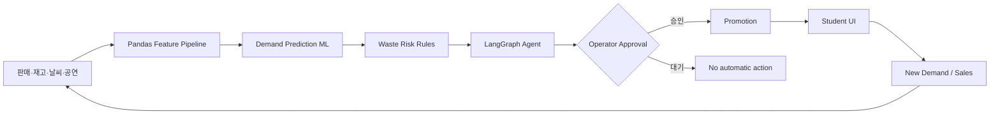

# ZeroFest AI

> **Predict → Operate → Engage → Optimize**  
> 대학축제의 판매·재고·날씨·공연 데이터를 분석해 폐기위험을 조기에 감지하고, 운영자 Action과 학생 혜택을 연결해 잔여재고가 발생하기 전에 대응하는 AI Festival Operating System.

이 저장소의 축제·판매·날씨·개입 효과 데이터는 전부 **Sample / Synthetic Festival Dataset 및 Demo Simulation**이다. 실제 전국 대학 판매데이터나 실증 효과로 주장하지 않는다.

## 해결하는 문제

대학축제 수요는 시간, 날씨, 공연 일정, 부스 위치에 따라 급변한다. 운영자는 품절을 피하려 여유 재고를 준비하지만 행사 말미에는 음식·식재료·음료가 남는다. ZeroFest AI는 폐기 후 처리보다 `수요예측 → 위험 감지 → 운영 변경 → 수요 유도 → 재예측`이라는 사전 예방에 집중한다.

세 사용자를 하나의 폐루프로 연결한다.

- 학생회: 축제 전체 Supply/Demand Control Tower
- 부스 운영자: 최소 입력과 Human-in-the-loop Action 승인
- 학생: 할인·지도·Quiz·Stamp 등 직접적인 혜택

## Core MVP

- 부스명·구역·메뉴·가격·초기재고 등록
- 판매 +1/+5/+10, 재고 ±10 원클릭 운영 입력
- 30분·1시간·행사 종료 판매량 및 잔여재고 예측
- 환경변수로 조정 가능한 LOW/MEDIUM/HIGH 폐기위험
- 실제 LangGraph StateGraph 워크플로
- 운영자 승인 전에는 실행되지 않는 할인 Action
- 승인 직후 학생 화면에 6,000원 → 4,800원 할인 노출
- 실제 DB 스냅샷만 사용하는 Admin AI Chat
- Before 70 → After 15 Demo Simulation과 한 번 클릭 Reset
- Mock Map, Quiz, Stamp Tour 확장 모듈
- 과거 데이터·Pipeline·Model Registry·LangGraph Audit 전용 AI Ops Console

## Architecture



상세 책임과 노드 흐름은 [docs/architecture.md](docs/architecture.md)를 참고한다.

## 설치 및 실행

Python 3.11 또는 3.12 권장.

```bash
python3 -m venv .venv
source .venv/bin/activate
python -m pip install --upgrade pip
pip install -r requirements.txt
cp .env.example .env
streamlit run app.py
```

브라우저에서 표시되는 로컬 주소(기본 `http://localhost:8501`)로 접속한다. API 키 없이 기본 Demo가 완전히 작동한다.

## GitHub 배포 준비

`main` 브랜치에 Push 또는 Pull Request가 생성되면 GitHub Actions가 Python 3.11 환경에서 합성 이력 데이터를 재생성하고 테스트를 실행한다. 웹 서비스는 Streamlit Cloud에서 이 저장소의 `app.py`를 엔트리 포인트로 지정해 배포할 수 있다. `.env`, SQLite 실행 DB, 모델 산출물, 외부 FreshRetailNet Parquet 원본은 저장소에 포함하지 않는다.

저장소를 만든 뒤에는 아래 명령으로 코드와 GitHub Actions 설정을 한 번에 게시할 수 있다. Git 사용자 이름과 이메일은 먼저 설정되어 있어야 한다.

```bash
./scripts/publish_github.sh https://github.com/HXEXN/ZeroFest-AI.git
```

## 3분 Demo

1. Admin: 닭꼬치 재고 180, 예상 잔여 70, 위험 HIGH 확인
2. Operator: `20% 마감 할인` 승인
3. Student: `6,000원 → 4,800원` 즉시 노출 확인
4. Simulation: `학생 반응 발생 → 재예측` 클릭
5. Admin: 예상 잔여 `70 → 15`, 위험 `HIGH → LOW` 확인

상세 발표 멘트는 [docs/demo_scenario.md](docs/demo_scenario.md)에 있다. 상태가 바뀌었으면 사이드바의 `Demo 전체 초기화`를 누른다.

## AI Model

MVP는 작은 데이터에 과도한 딥러닝을 적용하지 않고 `GradientBoostingRegressor`를 사용한다. 입력 Feature는 최근/이전 30분 판매량, 축제 일차, 시·분 단위 시각, 당일·전체 축제 종료까지 남은 시간, 기온·1시간 뒤 강수확률, 공연 종료 여부, 승인된 할인율, 메뉴 카테고리다. LLM은 판매량을 예측하지 않는다.

기본 모델은 **2023–2025년 3개 가상 대학·3일 축제의 38,880개 합성 과거 축제 레코드**를 학습한다. 각 레코드는 1분 관측 단위이며 `observation_timestamp`와 `target_window_end`를 초 단위 ISO 8601 형식으로 저장한다. 시·분·초와 종료까지 남은 초를 Feature로 보존하고, 한 관측 시점의 다음 30분 판매량을 Target으로 둔다. 2023–2024년으로 학습하고 2025년을 시간 순서 Hold-out으로 평가해 미래 데이터 누출을 피한다. 실데이터가 생기면 `.env`의 `HISTORICAL_DATA_PATH`에 같은 Schema의 CSV를 연결한다. 안정적인 심사 시연을 위해 A구역 닭꼬치 기준선과 개입값에는 명시적인 Demo calibration이 적용되며, 일반 부스는 모델 출력을 사용한다.

```bash
python scripts/train_model.py
```

폐기위험은 `expected_remaining / current_stock` 비율로 판정한다.

- 10% 미만: LOW
- 10% 이상 30% 미만: MEDIUM
- 30% 이상: HIGH

임계값은 `.env`의 `RISK_LOW_THRESHOLD`, `RISK_HIGH_THRESHOLD`에서 바꿀 수 있다.

## LangGraph Workflow

`load_current_state → predict_demand → calculate_waste_risk → check_operational_conditions → generate_action_candidates → operator_approval → execute_action → monitor_result → re_predict`

`operator_approval`에서 승인 ID가 없으면 워크플로는 대기 상태로 종료한다. 승인된 Action만 프로모션 테이블에 반영된다. LangGraph를 불러오거나 실행할 수 없을 때 같은 노드를 순차 실행하는 fallback으로 전환한다.

## Weather와 AI Chat Fallback

- 기본 `WEATHER_PROVIDER=mock`: 발표 시 네트워크와 무관하게 버전 관리된 예보 사용
- `WEATHER_PROVIDER=open-meteo`: Open-Meteo API Adapter 사용, 실패 시 Mock 자동 복귀
- `OPENAI_API_KEY` 없음/오류: 현재 SQLite 예측 스냅샷 기반 Grounded Local Chat
- 키 존재: 선택한 LLM은 같은 스냅샷을 근거로 설명만 생성

키는 `.env`에만 두며 코드에 넣지 않는다.

## 데이터 구조

SQLite에는 `University`, `Festival`, `Booth`, `Menu`, `InventorySnapshot`, `SalesSnapshot`, `Weather`, `FestivalEvent`, `Prediction`, `AgentAction`, `Promotion`에 대응하는 테이블이 있다. 향후 대학별 축제가 쌓여도 동일 스키마로 Cross-campus Demand Model을 학습할 수 있다.

샘플 CSV:

- `data/sample_sales.csv`
- `data/sample_inventory.csv`
- `data/sample_weather.csv`
- `data/sample_events.csv`
- `data/sample_historical_sales.csv` — 2023–2025 가상 대학 합성 이력

```bash
python scripts/reset_demo.py
pytest -q
```

## AI · ML · Data Operations Console

사이드바의 `AI · ML · Data Ops`는 서비스 운영 화면과 분리된 기술 관리 화면이다.

- Pipeline Control: Ingest → Validate → Feature → Train → Evaluate → Register 재실행
- Data Registry: 연도·대학·메뉴 분포, Null·중복·Target 품질 검사
- Model Registry: 시간 Hold-out MAE/R², Feature Importance, 학습 Run 이력
- Agent & Audit: LangGraph Guardrail, Action Queue, 최신 예측 감사 로그

현재 모든 학습 지표에는 Sample/Synthetic 경고가 표시되며 실제 효과로 과장하지 않는다.

## UI/UX 설계

제공된 Stitch 디자인의 통합 게이트웨이·관리자 관제·대형 터치 POS·학생 모바일 화면을 Streamlit 역할 화면에 연결했다. 색상, 숫자 가독성, 터치 타깃, 위험 상태, 반응형 계층에 대한 적용 기준은 [docs/design_handoff.md](docs/design_handoff.md)에 정리되어 있다.

## 향후 확장

- 학교·축제별 모델 평가 및 Cross-campus 일반화
- 익명 Zone 혼잡도 기반 재고 이동 최적화
- 실제 날씨/공연/판매 POS streaming adapter
- Quiz Reward와 Stamp ×2를 Agent의 수요 라우팅 Action으로 통합
- 개인정보 동의 기반의 최소 위치정보와 쿠폰 정산
- 대학축제에서 지역·대형 Festival Operating System으로 확장

## 안전 원칙

- 정밀 GPS와 불필요한 개인정보를 수집하지 않는다.
- 날씨를 AI가 예측한다고 표현하지 않고, Weather API 데이터를 판매량 예측 Feature로 사용한다.
- 모든 수치는 예측이며 할인·조리중단·이동의 최종 결정권은 운영자에게 있다.
- 전국 대학 실데이터가 확보되기 전에는 Sample/Synthetic라고 명시한다.
