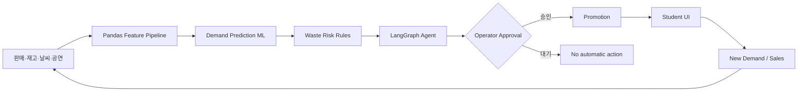

# ZeroFest AI

> **Predict → Operate → Engage → Optimize**  
> 대학축제의 판매·재고·날씨·공연 데이터를 분석해 폐기위험을 조기에 감지하고, 운영자 Action과 학생 혜택을 연결해 잔여재고가 발생하기 전에 대응하는 AI Festival Operating System.

이 저장소의 축제·판매·날씨·개입 효과 데이터는 전부 **Sample / Synthetic Festival Dataset 및 Demo Simulation**이다. 실제 전국 대학 판매데이터나 실증 효과로 주장하지 않는다.

## 해결하는 문제

대학축제 수요는 시간, 날씨, 공연 일정, 부스 위치에 따라 급변한다. 운영자는 품절을 피하려 여유 재고를 준비하지만 행사 말미에는 음식·식재료·음료가 남는다. ZeroFest AI는 폐기 후 처리보다 `수요예측 → 위험 감지 → 운영 변경 → 수요 유도 → 재예측`이라는 사전 예방에 집중한다.

세 사용자를 하나의 폐루프로 연결한다.

- 학생회: 축제 전체 Supply/Demand Control Tower
- 부스 운영자: 최소 입력과 Human-in-the-loop Action 승인
- 학생: 할인·지도·Quiz·Stamp 등 직접적인 혜택

## Core MVP

- 부스명·구역·메뉴·가격·초기재고 등록
- 판매 +1/+5/+10, 재고 ±10 원클릭 입력과 실재고 직접 교정
- 30분·1시간·행사 종료 판매량 및 잔여재고 예측 (2023–2025 합성 이력 학습 Gradient Boosting)
- 환경변수로 조정 가능한 LOW/MEDIUM/HIGH 폐기위험
- 실제 LangGraph StateGraph 워크플로
- 운영자 승인 전에는 실행되지 않는 할인 Action
- 승인 직후 학생 화면에 6,000원 → 4,800원 할인 노출
- 할인 승인을 새 개입으로 인식해 다음 30분 수요 예측을 즉시 상향
- 실제 DB 스냅샷만 사용하는 전용 AI 운영 Copilot (전체 축제/부스 범위 선택, 근거 공개)
- Agent가 큐에 넣은 Action과 근거를 그대로 노출하는 Control Tower
- 판매·재고 스냅샷이 실제로 기록되는 Before/After 시뮬레이션과 한 번 클릭 Reset
- 부스 상태에서 계산하는 구역 지도 (구역 단위 · 정밀 위치 미수집)
- Quiz 쿠폰과 Stamp Tour 진행 상태의 Demo DB 저장 (외부 쿠폰 정산은 미연동)
- 과거 데이터·Pipeline·Model Registry·LangGraph Audit 전용 AI Ops Console

## Architecture



상세 책임과 노드 흐름은 [docs/architecture.md](docs/architecture.md)를 참고한다.

## 설치 및 실행

Python 3.11 또는 3.12 권장.

```bash
python3 -m venv .venv
source .venv/bin/activate
python -m pip install --upgrade pip
pip install -r requirements.txt
cp .env.example .env
streamlit run app.py
```

브라우저에서 표시되는 로컬 주소(기본 `http://localhost:8501`)로 접속한다. API 키 없이 기본 Demo가 완전히 작동한다.

### 브랜치 변경사항 확인

Streamlit Community Cloud의 기존 URL은 배포 설정에 연결된 브랜치만 보여준다. `kjs` 작업 중에는 로컬에서 해당 브랜치를 실행해 확인한다.

```bash
git switch kjs
streamlit run app.py
```

운영자 화면은 `http://localhost:8501/operator`에서 확인한다. 원격 미리보기가 필요하면 `kjs`를 push한 뒤 Streamlit Community Cloud에서 같은 저장소·`kjs` 브랜치·`app.py`를 가리키는 별도 앱을 만든다. 기존 운영 앱의 브랜치를 바꾸지 않는다.

## 문제의 보편성

이 문제가 특정 축제 한두 건의 일이 아니라는 근거는 [docs/problem_evidence.md](docs/problem_evidence.md)에 출처와 함께 정리했다.

- **모집단**: 전국 고등교육기관 421개교, 재적학생 301만 명. 1987년경부터 전국 대부분 대학이 대동제를 개최하며, 2026년 봄에는 주요 20개교가 5월 6~29일 3주에 몰렸다.
- **실태**: 대학 축제 참여자 설문에서 일회용기 사용률 92%, 응답자 10명 중 8명이 "쓰레기 문제가 심각하다"고 답했다.
- **통계 공백**: 국회입법조사처는 2026년 9월 보고서에서 **현행 폐기물 통계에 '행사 폐기물'이 별도 항목으로 없다**고 지적했다. 축제를 개별 관리 단위로만 취급해 전국 비교 근거가 생산되지 않는다.
- **정책 방향**: 같은 보고서의 결론은 **"사후 처리에서 사전 감량으로"** 다. ZeroFest의 명제와 같다.
- **빈자리**: 다회용기 대책은 효과가 검증됐지만 줄이는 대상은 **용기** 폐기물이다. 부스가 재료를 과잉 준비해 **음식 자체**가 남는 문제를 다루는 대책은 확인되지 않았다.

근거가 개별 사례에 머무는 것은 자료 조사의 부족이 아니라 국가 통계가 이 범주를 집계하지 않기 때문이다. 그래서 이 제품의 1차 기여는 예측 이전에 **측정 체계**다. 부스별 준비량·판매량·잔여량이 같은 타임스탬프로 남아야 전국 비교와 정책 근거가 처음으로 만들어진다.

## 데이터 요구량 검증

"예측하려면 학습 데이터가 얼마나 필요한가"는 이 서비스의 가장 큰 리스크다. 답을 추정으로 두지 않고 실험으로 측정했다.

학습 단위는 행이 아니라 **독립 축제**다. 한 축제 안의 레코드는 같은 날씨·유동인구·메뉴 구성을 공유하므로, 한 축제에서 행을 더 모으는 것과 새 축제를 한 번 더 치르는 것은 정보량이 다르다. 독립 축제 24회를 학습 후보로, 학습에 쓰지 않은 축제 8회(12,893행)를 고정 평가셋으로 두고, 학습 크기마다 축제 조합을 다시 뽑아 5회 반복했다.

| 독립 축제 수 | 학습 행 | MAE | 표준편차 |
| --- | --- | --- | --- |
| 1회 | 1,595 | 6.96 | ±0.42 |
| **8회** | **12,806** | **5.98** | **±0.07** |
| 24회 | 38,443 | 5.86 | ±0.00 |

**정확도는 독립 축제 6회분에서 최고 성능의 5% 이내에 도달한다.** 다만 평균만 보면 안 된다. 1회로 학습하면 어떤 축제를 뽑았느냐에 따라 MAE가 ±0.42까지 흔들리고, 반복 간 편차가 평균의 2% 아래로 내려가는 시점은 **8회**다. 둘 중 큰 값인 8회를 준비 기준으로 삼는다.

축제 횟수를 못 늘릴 때는 규모가 대안이다. 같은 6회라도 `mvp · 12부스 × 4메뉴`은 MAE 6.25, `full · 30부스 × 8메뉴`은 5.92다.

실데이터가 한 번 들어왔을 때는 합성 사전학습이 요구량을 줄인다. 학습 분포보다 수요가 35% 높은 미관측 축제에서, **합성 사전학습 + 실데이터 절반**(MAE 8.59)이 **실데이터 전량 단독 학습**(MAE 8.84)보다 낫다. 실데이터 요구량이 대략 절반으로 줄어든다는 뜻이다.

```bash
python scripts/run_data_requirement_study.py     # 약 2분
python scripts/build_data_requirement_report.py
```

전체 결과는 [ZeroFest 데이터 요구량 검증 보고서](outputs/ZeroFest_데이터_요구량_검증_보고서.docx)에 있다. 여기서 말하는 "실데이터"도 분포를 이동시킨 합성 축제이므로, 실제 POS 데이터가 확보되면 같은 실험을 그대로 다시 돌려 검증해야 한다.

## GitHub 배포 준비

`main` 브랜치에 Push 또는 Pull Request가 생성되면 GitHub Actions가 Python 3.11 환경에서 합성 이력 데이터를 재생성하고 테스트를 실행한다. 웹 서비스는 Streamlit Cloud에서 이 저장소의 `app.py`를 엔트리 포인트로 지정해 배포할 수 있다. `.env`, SQLite 실행 DB, 모델 산출물, 외부 FreshRetailNet Parquet 원본은 저장소에 포함하지 않는다.

저장소를 만든 뒤에는 아래 명령으로 코드와 GitHub Actions 설정을 한 번에 게시할 수 있다. Git 사용자 이름과 이메일은 먼저 설정되어 있어야 한다.

```bash
./scripts/publish_github.sh https://github.com/HXEXN/ZeroFest-AI.git
```

## 2분 Demo

1. Admin: 사이드바의 `17:30`에서 축제 시작 이후 재고가 줄어든 것을 확인한다.
2. Admin: `18:00`으로 이동해 AI 잔여 위험 알림과 할인 추천을 확인한다.
3. Operator: `18:30`으로 이동해 `20% 마감 할인`을 승인하고 Student에서 `6,000원 → 4,800원` 노출을 확인한다.
4. Operator: 학생 주문을 원클릭으로 입력한다. 판매량·재고·주문 건수가 한 번에 기록된다.
5. Simulation: `20:00까지 판매 반영 · 30분마다 재예측`을 누른다. 이미 입력한 주문은 첫 구간 판매량에 포함되어 중복 집계되지 않는다.
6. Before / After: AI 추천 미적용 시 종료 예상 잔여와 추천 적용 후 20:00 재예측 잔여를 비교하고, 세 번의 폐쇄 루프 로그를 확인한다.

초기 재고는 닭꼬치 400, 레몬에이드 450, 떡볶이 350, 와플 250개다. 화면의 예측값은 모델이 계산하므로 문서에 고정하지 않는다. 데이터나 모델이 바뀌면 Before / After도 함께 바뀐다.

시간 버튼은 사이드바의 `Demo 전체 초기화` 바로 아래에 있으며 언제든 다시 누를 수 있다. 버튼을 누를 때마다 해당 CSV 시점을 깨끗하게 재생하므로 이전 시점으로도 돌아갈 수 있다. 상세 발표 멘트는 [docs/demo_scenario.md](docs/demo_scenario.md)에 있다.

## AI Model

MVP는 작은 데이터에 과도한 딥러닝을 적용하지 않고 `GradientBoostingRegressor`를 사용한다. 입력 Feature 15개는 최근/이전 30분 판매량, **최근 30분 주문 건수**, 현재·준비 재고, 당일 종료까지 남은 시간, 축제 일차, 주말 여부, 공연 종료 임박, 1시간 뒤 강수확률, 기온, 적용 중인 할인율, 신규 적용 할인율, 메뉴 유형, 캠퍼스 규모다. LLM은 판매량을 예측하지 않는다.

시각을 중복 표현하던 Feature(`hour`, `minute_of_day`, `seconds_to_close`, `minutes_to_festival_end`, `second_of_minute`)는 절대 상관이 최대 1.000이고 분산팽창계수가 무한대여서 제거했다. `recent_tickets_30m`은 운영자가 `1·5·10개 주문` 버튼을 누른 횟수다. 한 번 누르면 한 팀의 주문이므로, 판매량과 별개로 장바구니 크기가 관측된다. `new_discount_rate`는 승인된 지 30분이 지나지 않은 할인을 분리한다. 이미 30분 이상 적용된 할인은 최근 판매량에 반영되어 있어, 이를 구분하지 않으면 모델이 "지금 할인하면 어떻게 되는가"에 답하지 못한다.

기본 모델은 **2023–2025년 3개 가상 대학 × 3일 축제의 15,552개 합성 레코드**를 학습한다. 3개 연도 × 3개 캠퍼스 = 9개 칸은 각각 **서로 다른 시드의 독립 시뮬레이션**이다. 한 번의 실행을 복사해 타깃만 스칼라 배하면 검증 연도가 학습 연도의 결정론적 변환이 되어, 작년 행을 복사하는 규칙만으로 R² 1.000이 나오기 때문이다.

재고가 0이 되어 타깃 30분 구간이 잘린 레코드(`censored_window_flag`)는 학습과 평가에서 모두 제외한다. 판매량은 수요가 아니라 검열된 수요이며, 그 0을 학습하면 이미 품절된 부스에서 수요가 없다고 예측하게 된다. 2023–2024년으로 학습하고 2025년을 시간 순서 Hold-out으로 평가한다.

화면에 표시되는 모든 수치는 모델 출력이다. 특정 부스를 위한 고정 시연값은 없다. 실데이터가 생기면 `.env`의 `HISTORICAL_DATA_PATH`에 같은 Schema의 CSV를 연결한다.

```bash
python scripts/train_model.py
```

폐기위험은 `expected_remaining / current_stock` 비율로 판정한다.

- 10% 미만: LOW
- 10% 이상 30% 미만: MEDIUM
- 30% 이상: HIGH

임계값은 `.env`의 `RISK_LOW_THRESHOLD`, `RISK_HIGH_THRESHOLD`에서 바꿀 수 있다.

## LangGraph Workflow

`load_current_state → predict_demand → calculate_waste_risk → check_operational_conditions → generate_action_candidates → operator_approval → execute_action → monitor_result → re_predict`

`operator_approval`에서 승인 ID가 없으면 워크플로는 대기 상태로 종료한다. 승인된 Action만 프로모션 테이블에 반영된다. LangGraph를 불러오거나 실행할 수 없을 때 같은 노드를 순차 실행하는 fallback으로 전환한다.

## Weather와 AI Chat Fallback

- 기본 `WEATHER_PROVIDER=mock`: 발표 시 네트워크와 무관하게 버전 관리된 예보 사용
- `WEATHER_PROVIDER=open-meteo`: Open-Meteo API Adapter 사용, 실패 시 Mock 자동 복귀
- `OPENAI_API_KEY` 없음/오류: 현재 SQLite 예측 스냅샷 기반 Grounded Local Chat
- 키 존재: 선택한 LLM은 같은 스냅샷을 근거로 설명만 생성
- Copilot 지원 질의: 전체 운영 브리핑, 위험 우선순위, 할인 근거, 품절 예상 시각, 날씨 영향, 추천 Action, 이관 후보
- 답변마다 현재 재고·30분 판매/예측·종료 잔여/위험도 근거를 함께 표시

키는 `.env`에만 두며 코드에 넣지 않는다.

## 데이터 구조

SQLite에는 `University`, `Festival`, `Booth`, `Menu`, `InventorySnapshot`, `SalesSnapshot`, `Weather`, `FestivalEvent`, `Prediction`, `AgentAction`, `Promotion`에 대응하는 테이블이 있다. 향후 대학별 축제가 쌓여도 동일 스키마로 Cross-campus Demand Model을 학습할 수 있다.

샘플 CSV:

- `data/sample_sales.csv`
- `data/sample_inventory.csv`
- `data/sample_weather.csv`
- `data/sample_events.csv`
- `data/final_training_dataset.csv` — 2023–2025 대학 축제 최종 합성 학습 데이터

```bash
python scripts/reset_demo.py
pytest -q
```

## AI · ML · Data Operations Console

사이드바의 `AI · ML · Data Ops`는 서비스 운영 화면과 분리된 기술 관리 화면이다.

- Pipeline Control: Ingest → Validate → Feature → Train → Evaluate → Register 재실행
- Data Registry: 연도·대학·메뉴 분포, Null·중복·Target 품질 검사
- Model Registry: 시간 Hold-out MAE/R², Feature Importance, 학습 Run 이력
- Agent & Audit: LangGraph Guardrail, Action Queue, 최신 예측 감사 로그

현재 모든 학습 지표에는 Sample/Synthetic 경고가 표시되며 실제 효과로 과장하지 않는다.

## UI/UX 설계

제공된 Stitch 디자인의 통합 게이트웨이·관리자 관제·대형 터치 POS·학생 모바일 화면을 Streamlit 역할 화면에 연결했다. 색상, 숫자 가독성, 터치 타깃, 위험 상태, 반응형 계층에 대한 적용 기준은 [docs/design_handoff.md](docs/design_handoff.md)에 정리되어 있다.

## 향후 확장

- 학교·축제별 모델 평가 및 Cross-campus 일반화
- 익명 Zone 혼잡도 기반 재고 이동 최적화
- 실제 날씨/공연/판매 POS streaming adapter
- Quiz Reward와 Stamp ×2를 Agent의 수요 라우팅 Action으로 통합
- 개인정보 동의 기반의 최소 위치정보와 쿠폰 정산
- 대학축제에서 지역·대형 Festival Operating System으로 확장

## 안전 원칙

- 정밀 GPS와 불필요한 개인정보를 수집하지 않는다.
- 날씨를 AI가 예측한다고 표현하지 않고, Weather API 데이터를 판매량 예측 Feature로 사용한다.
- 모든 수치는 예측이며 할인·조리중단·이동의 최종 결정권은 운영자에게 있다.
- 전국 대학 실데이터가 확보되기 전에는 Sample/Synthetic라고 명시한다.
