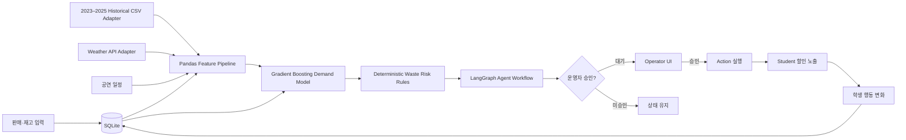
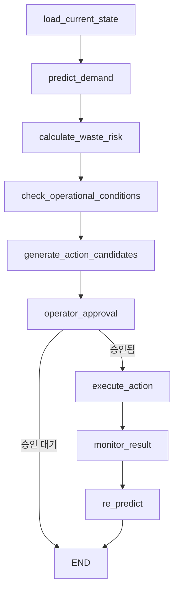

# ZeroFest AI Architecture

ZeroFest AI의 핵심은 예측 정확도만 과장하는 것이 아니라, 예측 결과를 실제 운영자 승인과 학생 수요 유도까지 연결하는 폐루프(Closed Loop)다. MVP의 모든 초기 레코드는 `Sample / Synthetic Festival Dataset`이다.

## 책임 분리

| 계층 | 책임 | 임의 판단 방지 |
|---|---|---|
| ML Prediction | 향후 30분·1시간·종료 시점 판매량 | LLM이 수치를 생성하지 않음 |
| Waste Risk | 잔여재고 비율로 LOW/MEDIUM/HIGH | `.env` 임계값, 결정론적 계산 |
| LangGraph | 상태 로드부터 재예측까지 실행 순서 관리 | 노드 및 조건 분기 명시 |
| Business Rules | 조리 중단·할인·이동·프로모션 후보 | 입력 근거가 있는 규칙만 사용 |
| Human Approval | 실행 여부 최종 결정 | 운영자 승인 전 `PENDING` |
| LLM Explanation | DB 스냅샷 기반 자연어 설명 | API 장애 시 grounded local fallback |

## LangGraph 노드

LangGraph 패키지를 불러오거나 워크플로를 실행할 수 없는 환경에서는 동일 노드를 순서대로 실행하는 fallback이 데모 중단을 막는다. 정상 설치 환경의 실행 엔진은 `LangGraph StateGraph`로 기록된다.

## 확장 경로

- Mock Weather를 Open-Meteo 또는 기관 날씨 API로 교체
- 축제별 레코드가 누적되면 Cross-campus Demand Model 재학습
- Postgres/streaming ingestion으로 SQLite adapter 교체
- Zone 단위 익명 혼잡도와 재고 이동 최적화 연결
- 승인된 Quiz/Stamp 보상의 쿠폰 정산 시스템 연결
